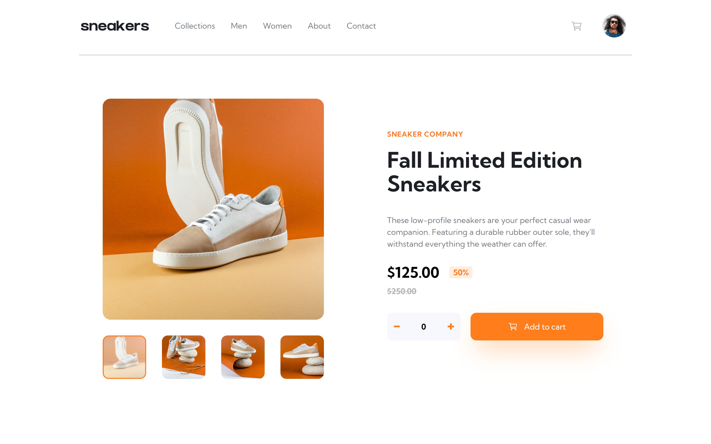

# Frontend Mentor - E-commerce product page solution

This is a solution to the [E-commerce product page challenge on Frontend Mentor](https://www.frontendmentor.io/challenges/ecommerce-product-page-UPsZ9MJp6). Frontend Mentor challenges help you improve your coding skills by building realistic projects.

## Table of contents

- [Overview](#overview)
  - [The challenge](#the-challenge)
  - [Screenshot](#screenshot)
  <!-- - [Links](#links) -->
- [My process](#my-process)
  - [Built with](#built-with)
  - [Project development process](#project-development-process)
  - [Continued development](#continued-development)
- [Author](#author)


## Overview

### The challenge

Users should be able to:

- View the optimal layout for the site depending on their device's screen size
- See hover states for all interactive elements on the page
- Open a lightbox gallery by clicking on the large product image
- Switch the large product image by clicking on the small thumbnail images
<!-- - Add items to the cart
- View the cart and remove items from it -->

### Screenshot



This is the screenshot of my solution

<!-- ### Links -->

## My process

### Built with

- Semantic HTML5 markup
- CSS custom properties
- Flexbox
- CSS Grid
- Mobile-first workflow
- [React](https://reactjs.org/) - JS library
- [Tailwindcss](https://tailwindcss.com/) - CSS framework
- [Ionicons](https://ionicons.com) - Icons

### Project development process

In this section, I'll describe how I built this project by listing the functions I created in the step-by-step of the development. Please note, this is simple the way I managed to complete this project. So feel free to do it whatever way you like.

#### UI

In all my projects, I always ensure UI of my project is responsive and completed before diving into the interactivities of the project. This is mainly the base UI, ie not including the lightbox or the cart, because I like to get a good feel of the project. 

Here, I created the images and thumbnails states for the mobile and desktop components. Initially, I hardcoded the `previewImg` into the `desktopPreview` to display the preview image for the desktop  using:

```jsx
    
```

This was before the previewDisplay function and the `previewImg` state.

#### previewDisplay

This function enables the preview image to be changed when a thumbnail is clicked. The id of each of the thumbnails was set from their indexes and using event, I targeted the id of the clicked thumbnail to set the index of the images for the preview image.
```js
    setPreviewImg(images[e.target.id])   
```

#### thumbnailActive

Only the clicked/active thumbnail should have an active style to it; opacity of 60% with an orange border. I created a `thumbnailRef` (using createRef()) which is basically the parent container with all the thumbnail images. The `thumbnailRef` allows me to loop through the thumbnail images (its childNodes), removing any active style from all the inactive thumbnail images.

I also created a `currentIndex` which is the index of the `previewImg` (gotten from the id of the clicked thumbnail as stated in `previewDisplay()` above) in the images state.

```js
  const currentIndex = parseInt(images.indexOf(previewImg))
```

useEffect is to ensure that as soon as the component mount, the active style is on the first thumbnail image.
```js
  useEffect(() => {
    thumbnailActive()
    // eslint-disable-next-line    
  }, [])

```


#### lightBox

`modal` state is a boolean which changes to true when the preview image is clicked. Before created this state, I made the component and completed the UI for the lightBox. I placed this lightBox in the product component and it won't display at all unless `modal` is true. 

The lightBox component also contains the DestopPreview component and additionally has back and forward direction arrows to check through the different images.

#### close

This removes the lightBox by setting the `modal` state to false. It happens when the close icon is clicked.


#### modalThumbnailActive

The active classes only displays on the base thumbnail and not the one of the lightBox. This function is for adding active style in the thumbnails of the lightBox.

I used `useRef` to create the `modalThumbnailRef`. In order to use this ref, make sure the modal is true, else the ref is for the base thumbnails and the app crashes.

This is very similar to the `thumbnailActive()` but the difference is I put the ref on the thumbnail div (in `thumbnailActive()`, the ref was on the thumbnail parent container) and bubbled up to the thumbnail parent container. The reason I had to do this was because of all the code I tried, this was the one that worked perfectly.

The useEffect was then updated to:
```js
  useEffect(() => {

    thumbnailActive()
    modalThumbnailActive()
    // eslint-disable-next-line    
  }, [previewImg, modal])
```

Other than for the same reason as in `thumbnailActive()`, the `previewImg` and `modal` parameter is for the the component to mount whenever the state of `previewImg` or `modal` changes. 


#### nextPreview

This function pertains the next icon in the lighBox component. On click, the `currentIndex` increases, manipulating the state of the preview image and the active style of all active thumbnails, as long as the number doesn't exceed the amount of steps it can take to reach the final image. 


#### prevPreview

This is similar to `nextPreview()`. The difference is it decreases until it reaches zero.


#### nextSlide
This is for the mobile slider component. Like a slider version of the `nextPreview()`


#### prevSlide

Slider version of `prevPreview()`

#### quantity

Depending on the quantity of product you wish to add to the cart, `quantity` function check the if the event is on the input tag, the minus icon or the plus icon. You can increase or decrease by adding a number, clicking on the icon or using the up and down keys.


#### cartDisplay
I created a cart component which displays on click of the cart icon (toggles the component by using the state: `showCart`). Ternary operator was used to check if the cart items are empty or contains anything.


#### addCart
Initially, I wanted to use `reduce` to sum all the number input with each click, but the code didn't work correctly. So I set the `total` state to the number input value. 

According to this function, if the number is zero, it increases to one since the least amount a person can order is one.

I also add the object to the cart, with the img, title, price and quantity using the `cartItems` state.

To get all these values, I added `ref` to the h3 title, the price div and the number input tag in the product details component.

The little orange circle above the cart icon only show if the cart isn't empty.


### Continued development
This is a great project to progress into a clothing ecommerce project. Perhaps one day I'll do so.


## Author

- Github - [Hikmah Yousuph](https://github.com/Hikmahx)
- Frontend Mentor - [@Hikmahx](https://www.frontendmentor.io/profile/Hikmahx)
- Email - [hikmayousuph@gmail.com](hikmayousuph@gmail.com)
- LinkedIn - [Hikmah Yousuph](linkedin.com/in/hikmah-yousuph-449467204/)